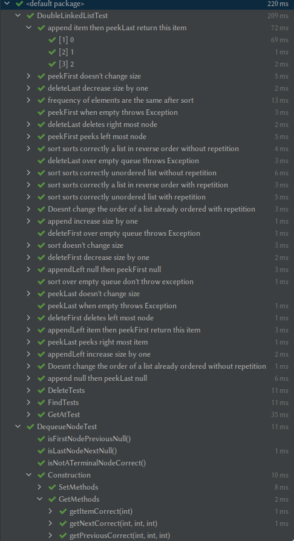
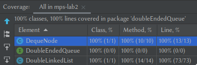

# Double Ended Queue

## Classes to be tested

These are the classes interfaces that will be tested.

### Double Ended Queue

Interface of Double Ended Queue.

```
public interface DoubleEndedQueue<T> {
    // Basic operations
    void append(T item) ;
    void appendLeft(T item) ;
    void deleteFirst() ;
    void deleteLast() ;
    T peekFirst() ;
    T peekLast() ;
    int size() ;
}
```

### DoubleLinkedList

Our implementation of DoubleEndedQueue.

```
public class DoubleLinkedList<T> implements DoubleEndedQueue<T> {
    private DequeNode<T> first;
    private DequeNode<T> last;
    private int size;

    public DoubleLinkedList(){
        size = 0;
    }

    @Override
    public void append(T item) {
        if (size() == 0){
            appendWhenEmpty(item);
        }else {
            DequeNode<T> node = new DequeNode<>(item, last, null);
            last.setPrevious(node);
            last = node;
        }

        size++;
    }

    @Override
    public void appendLeft(T item) {
        if (size() == 0){
            appendWhenEmpty(item);
        }else {
            DequeNode<T> node = new DequeNode<>(item, null, first);
            first.setNext(node);
            first = node;
        }

        size++;
    }

    @Override
    public void deleteFirst() {
        if (size() == 0)
            throw new RuntimeException("Error at delete. Can't delete over empty queue");

        if (size() == 1){
            deleteWhenOnlyOneNode();
        }else {
            first = first.getPrevious();
            first.setNext(null);
        }

        size--;
    }

    @Override
    public void deleteLast() {
        if (size() == 0)
            throw new RuntimeException("Error at delete. Can't delete over empty queue");

        if (size() == 1){
            deleteWhenOnlyOneNode();
        }else {
            last = last.getNext();
            last.setPrevious(null);
        }

        size--;
    }

    @Override
    public T peekFirst() {
        if (size() == 0)
            throw new RuntimeException("Error at peek. Can't peek over empty queue");
        return first.getItem();
    }

    @Override
    public T peekLast() {
        if (size() == 0)
            throw new RuntimeException("Error at peek. Can't peek over empty queue");
        return last.getItem();
    }

    @Override
    public int size() {
        return size;
    }

    private void appendWhenEmpty(T item) {
        DequeNode<T> node;
        node = new DequeNode<>(item, null, null);
        first = node;
        last = node;
    }

    private void deleteWhenOnlyOneNode() {
        first = null;
        last = null;
    }
}
```

### Queue Node

Class representing a node of a double-ended queue (deque). 
Each node has pointers to the next and previous nodes. 
The previous and next of the first and last node of the queue is null.

```
package doubleEndedQueue;

/**
 * Class representing a node of a double-ended queue (deque). Each node has pointers to
 * the next and previous nodes.
 * The previous and next of the first and last node of the deque is null.
 *
 * @param <T>
 */
public class DequeNode<T> {
    private T item ;
    private DequeNode<T> next ;
    private DequeNode<T> previous ;

    public T getItem() {
        return item;
    }

    public DequeNode<T> getNext() {
        return next;
    }

    public DequeNode<T> getPrevious() {
        return previous;
    }

    public DequeNode(T item, DequeNode<T> next, DequeNode<T> previous) {
        this.item = item ;
        this.next = next ;
        this.previous = previous ;
    }

    public boolean isFirstNode() {
        return previous == null ;
    }

    public boolean isLastNode() {
        return next == null ;
    }

    public boolean isNotATerminalNode() {
        return (!isFirstNode() && !isLastNode()) ;
    }

    // Setters
    public void setItem(T item) {
        this.item = item;
    }

    public void setNext(DequeNode<T> node){
        this.next = node;
    }

    public void setPrevious(DequeNode<T> node){
        this.previous = node;
    }
}
```

## Test Cases

### Double Ended Queue

- Append.
  - append null then peekLast null.
  - appendLeft null then peekFirst null.
  - append item then peekLast return this item.
  - appendLeft item then peekFirst return this item.
- Delete.
  - deleteFirst over empty queue throws Exception.
  - deleteLast over empty queue throws Exception.
  - deleteFirst deletes left most node.
  - deleteLast deletes right most node.
- Peek. 
  - peekFirst when empty throws Exception.
  - peekLast when empty throws Exception.
  - peekFirst peeks left most node.
  - peekLast peeks right most node.
- Size 
  - append increase size by one.
  - appendLeft increase size by one.
  - deleteFirst decrease size by one.
  - deleteLast decrease size by one.
  - peekFirst doesn't change size.
  - peekLast doesn't change size.
- GetAt
  - on empty list throws exception
  - on non-existing index throws exception
  - on existing index returns the correct element
  - Get last index = peekLast
  - Get first index = peekFirst
### Queue Node 

- Construction:
  - GetItemCorrect() -> Compare if getItem() returns the item of a node.
  - GetNextCorrect() -> Compare if getNext() returns the item of a node.
  - GetPreviousCorrect() -> Compare if getPrevious() returns the item of a node.
  - SetItemCorrect() -> Compare if setItem() sets the item of a node.
  - SetNextCorrect() -> Compare if setNext() sets the next node of a node.
  - SetPreviousCorrect() -> Compare if setNext() sets the previous node of a node.
- isFirstNodePreviousNull() -> Checks if isFirstNode() is true, then the previous node is null.
- isFirstNodePreviousNull() -> Checks if isLastNode() is true, then the next node is null.
- Get if a node is a terminal node:
- isNotATerminalNodeCorrect() -> Checks if isNotATerminalNode() is true, then:
  - Is terminal node if next is null.
  - Is terminal node if previous is null.
  - Is terminal node if both next and prev are null.

## Screenshots

Screenshots of the results

### Test passed



### Coverage


